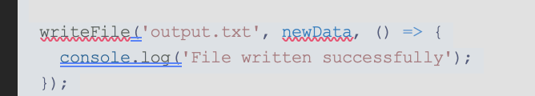

# Bug hunting

This page explain the cause of the bug in the source code received and propose a solution as well.

The bug is represented by the fact that the write error is not handled.

If the write operation fails, then the code will print the success message.

To fix the bug, we just simply have to check if the callback was called with an error (which means the write operation failed). Check [bug.js](./bug.js) file to see the fix.
