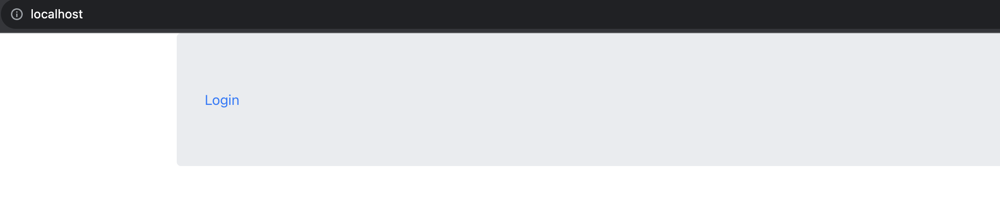
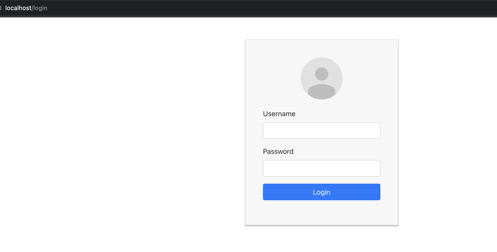
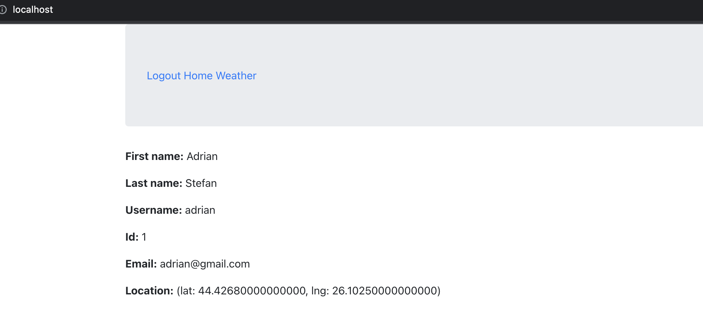
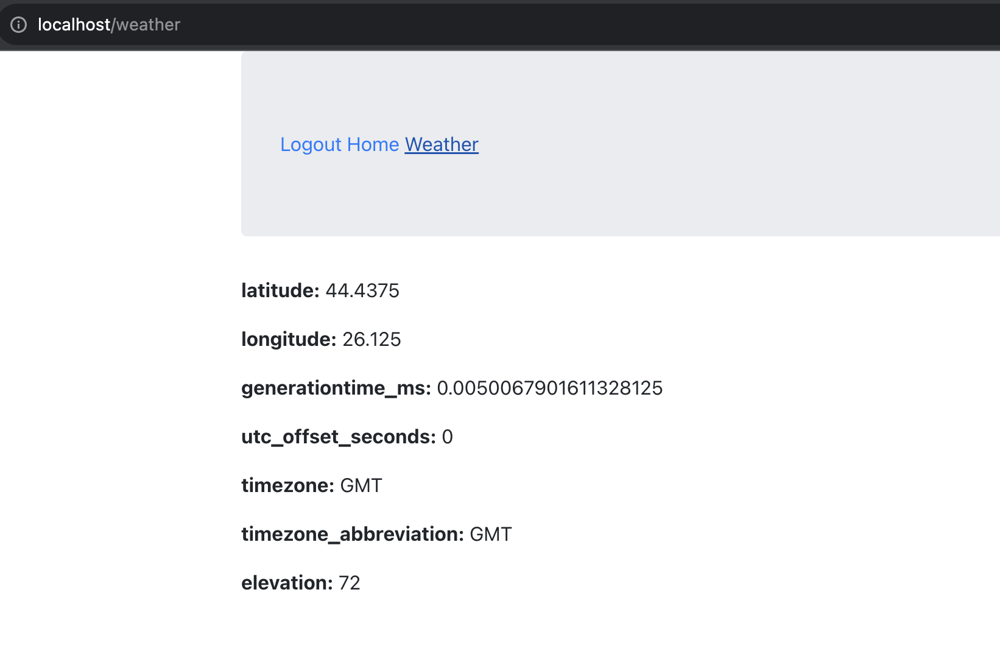

# Docker infrastructure

To create Docker infrastructure needed for running the app, please follow the steps below

- create a *.env* file which must contains the following environment variables
```bash
MYSQL_ROOT_PASSWORD="" # mysql root user password
MYSQL_PASSWORD="" # mysql non-root user password
MYSQL_USER="" # non-root user name
MYSQL_DATABASE="" # database name
```

- run docker compose command
```bash
docker compose up -d
```

- wait until all containers are running and then open http://localhost to acess the app


## Application print screens

- user not logged in


- login page


- home page


- additional page

